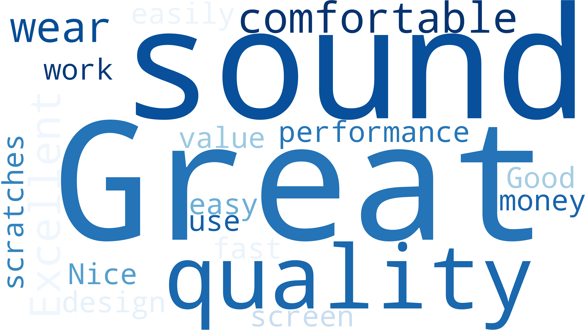

  

# 🚀 Smart Review Intelligence System  
**AI-Powered Sentiment Analysis Dashboard using Python NLP (TextBlob) and Power BI**

---

## 📌 Project Overview

This AI-powered analytics project combines Python-based Natural Language Processing (NLP) and interactive dashboards in Power BI to analyze customer reviews, detect sentiment, and surface product insights.  

Using **TextBlob**, we calculate sentiment polarity scores and classify customer feedback into **Positive**, **Negative**, or **Neutral**, then visualize those insights with Power BI, including time trends, sentiment-based ratings, and word-level patterns.

---

## 🛠 Tools & Technologies Used

- 🧠 **Python (TextBlob, Pandas, WordCloud)**
- 🧾 **Jupyter Notebook**
- 📊 **Power BI**
- ☁️ **Matplotlib + WordCloud for sentiment visuals**
- 📈 **Data-driven decision support using AI**

---

## 💡 Key Features

- ✅ Automatic **sentiment classification** using TextBlob
- ✅ Assigns **polarity scores** between -1 and +1 for each review
- ✅ Classifies reviews as **Positive / Negative / Neutral**
- ✅ Generates **HD WordClouds** for each sentiment class
- ✅ Builds a **clean, modern Power BI dashboard**
  - Sentiment pie chart  
  - Average rating per sentiment  
  - Sentiment trend over time  
  - Interactive KPI cards  
  - Full review sentiment breakdown

---

## 📸 Project Visuals

### 🔷 Final Power BI Dashboard

### ☁️ WordCloud Visualizations

| Positive Feedback | Negative Feedback |
|-------------------|------------------|
|  |  |

---

---

## 🧠 Business Use Case

This system can be used by:
- **Product Managers** to identify feature gaps
- **Customer Success Teams** to track satisfaction
- **Marketing Teams** to monitor public sentiment
- **Business Analysts** to back decisions with voice-of-customer data

---

## 🚀 How to Run This Project

1. Clone the repository  
2. Run the `.ipynb` notebook to generate scores and WordClouds  
3. Load `sentiment_output.csv` into Power BI  
4. Explore the `.pbix` file or publish the dashboard

---

## 🙋‍♂️ Created By

**Mehfil Palapra**  
AI-Powered Data & Business Analyst  
📫 [LinkedIn](https://www.linkedin.com/in/mehfil-palapra)  
📂 [GitHub Portfolio](https://github.com/mehfilpalapra)

---

> ⭐ If you like this project, give it a star!  
> 📬 Feedback and contributions are welcome.

